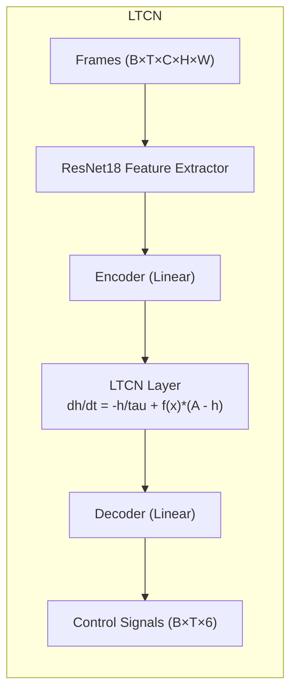
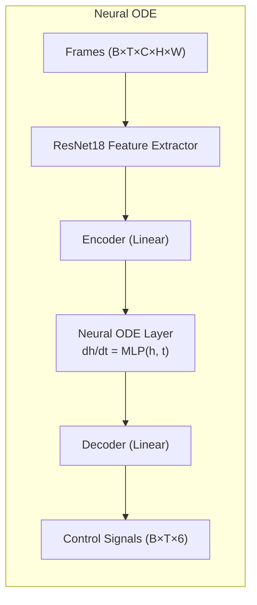

# Robustness Comparison of Neural ODE and LTCN in Autonomous Driving

This repository implements and compares continuous-time neural network models—**Liquid Time-Constant Networks (LTCN)** and **Neural Ordinary Differential Equations (Neural ODE)**—specifically focusing on their robustness in autonomous driving tasks.

The project evaluates how these models perform when subjected to input corruption (e.g., visual noise), demonstrating the differences in stability and generalization capabilities between the two architectures.

## Getting started

Set up the project with **either** of the following methods.

### 1. pip + venv

```bash
git clone [https://github.com/satra-11/auto-driving-model-test](https://github.com/satra-11/auto-driving-model-test)
cd auto-driving-model-test
python -m venv .venv
source .venv/bin/activate
pip install -r requirements.lock
```

### 2. uv

```bash
git clone [https://github.com/satra-11/auto-driving-model-test](https://github.com/satra-11/auto-driving-model-test)
cd auto-driving-model-test
uv sync
```

### 3. Using Makefile

Please use `Makefile` for convenience:

```bash
make help
```

| Command | Description |
|:---|:---|
| `make install` | Install dependencies |
| `make extract` | Extract features from raw data |
| `make train` | Train the driving models |
| `make evaluate` | Evaluate trained models |
| `make compare` | Compare robustness (LTCN vs NODE) |
| `make mlflow` | Start MLflow server |
| `make all` | Run full pipeline (train → evaluate) |

-----

## Features

- **LTCN Implementation**: Liquid Time-Constant Networks with specialized gating mechanisms.
- **Neural ODE Implementation**: Standard Neural ODEs using explicit Euler integration for fair comparison.
- **Robustness Evaluation**: Automated testing pipeline to evaluate model performance under various noise levels.
- **MLflow Integration**: Experiment tracking for training metrics and evaluation artifacts.

-----

## Commands

### 1. Feature Extraction (Optional)

Pre-compute ResNet18 features to speed up training:

```bash
python3 scripts/extract_features.py
```

### 2. Training

Train the models using the following commands:

**Train LTCN:**
```bash
python3 scripts/train_driving.py --model ltcn
```

**Train Neural ODE:**
```bash
python3 scripts/train_driving.py --model node
```

#### Key Arguments
- `--model`: `ltcn` or `node`.
- `--epochs`: Number of training epochs (default: 100).
- `--sequence-length`: Input sequence length (default: 20).
- `--corruption-rate`: Rate of training data corruption (default: 0.2).

### 3. Evaluation

Evaluate the trained models against different noise levels to test robustness.

```bash
python3 scripts/evaluate_driving.py --model ltcn --data-dir ./data/raw --model-path ./driving_results/LTCN_checkpoint.pth
```

This will output MSE and MAE metrics for increasing levels of noise (0.0 to 0.5).

### 4. Monitoring

Start the MLflow server to visualize training curves and results:

```bash
uv run mlflow ui --port 5001
```

-----

## Model Architectures

We compare two distinct continuous-time architectures. Both use a pre-trained ResNet18 backbone for processing visual inputs.

### 1. LTCN (Liquid Time-Constant Network)

LTCN introduces time-varying time constants to the hidden state dynamics, allowing for adaptive temporal processing.



### 2. Neural ODE

Our Node implementation uses a standard MLP parameterization for the derivative function.



### Integration Scheme

To ensure a fair comparison, both models utilize **Euler integration** with the same time-step settings during training and inference. This isolates the architectural differences from numerical solver variations.

-----

## Results

After running the evaluation, you will obtain:
1.  **MSE/MAE vs. Noise Level**: Quantitative metrics showing how performance degrades with noise.
2.  **Comparison Plots**: Visualizations comparing the robustness curves of LTCN vs. Neural ODE.

-----

## Dataset

This project utilizes the [Honda Research Institute Driving Dataset (HDD)](https://usa.honda-ri.com/datasets).

Structure:
```
/data/
├───raw/
│   ├───camera/
│   │   ├───<sequence_0>/
│   │   │   ├───00000.jpg
│   │   │   └───...
│   │   └───<sequence_n>/
│   └───sensor/
│       ├───<sequence_0>.npy
│       └───<sequence_n>.npy
└───processed/
    ├───<sequence_0>.npy
    └───<sequence_n>.npy
```
